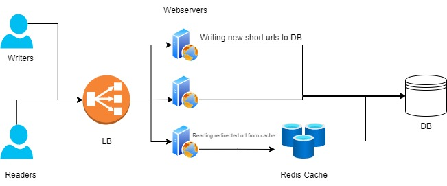

# shorti.fy

## What is URL Shortening System?
In layman's terms, URL Shortening is a service we can shorten the original link.
You provide a long URL and system outputs a short URL which can be used as an alternative to long url.

## Requirement 
1. Input Original Link and a unique and short url will be outputted
2. High Availability of the system (Zero Downtime, 100% Availability, Deploy it on K8s service ?)
3. Minimum Latency (We can use caching during redirect, deploy the infra on cloud with geo-replication)

## Analysis
### Things to consider
1. Number of requests for reading the URL
2. Number of requests for writing (shortening) the URL
3. Storage requires for DB (Capacity)
4. Storage requires for caching (Redis)
5. Web server hosting (Ideal scenario would be to host on k8s which provides features of Auto Scaling, Auto Restart etc.) 
6. Shortening Algorithm Used
7. Security—Hackers can spam the system with random urls
8. Database type used for storage
9. Language use for backend

## High-Level Design

1. Two kinds of users
   1. Reader—User who will hit the short url and will be redirected to original long url
   2. Writer—User who comes to shorti.fy portal to shorten the URL
2. Web Servers—Backend servers that will transform/shorten the URL and also redirect user to original URl
3. Redis Cache - Caching layer that will be used in order ro cache the redirect url for more frequently used URls.
4. Database
5. Load Balancer - LB to distribute request among the web servers

## Selection of Language

### Golang Advantages
1. **Golang vs. Java**

   Java is compiled on a virtual machine, its code must be changed to bytecode before passing through the compiler. Even though this step makes it a platform-independent language, it significantly slows down the compilation process.
   Golang doesn’t rely on a virtual machine for code compilation and is directly compiled from the binary file. That’s why it is much faster than Java when it comes to application development. Golang’s automatic garbage collection also contributes to its speed and makes it much faster than Java

2. **Golang vs. C++**

   C++ modules often take a lot of time to parse and compile headers
   Golang only uses packages that are necessary to run the program. Golang has a feature that reminds the developer to remove unused packages from the final build. It throws a compilation error

3. **Golang vs. Node.js**

   Golang processing is faster and more lightweight than Node.js. Golang can also handle subroutines concurrently (i.e., it can execute threads in parallel). This is different from Node.js, which is single-threaded.
   
4. **Concurrency Golang**

   1. Traditional general purpose programming languages use threads provided and scheduled by the operating system (or a rather abstract concept of “workers” that are based on OS threads) to allow you to run multiple functions concurrently
   2. Those threads usually have a stack of a few megabytes in memory meaning that you can’t spawn too many of them, for example, 1000 threads where each consumes 1 MB of memory would require 1 GB of memory already.
   3. Context switches on OS threads aren’t cheap. Most registers and some caches will need to be swapped out.
   4. Go’s goroutines have a flexible stack that’s at least 2kb in memory, and it grows as needed. This means that you can literally spawn millions of them compared to only thousands of threads.
   5. Goroutines are multiplexed through an OS thread pool in the built-in runtime and can thus achieve 99.9% CPU utilization.
   6. Writing blocking Go code is totally fine since a goroutine will automatically be swapped out for another when it’s getting blocked without blocking the CPU. No async/await, no promises, no callbacks, no thread-pools, no tasks, just stupidly easy blocking code.
>Golang Advantages Refs
> 1. https://www.linkedin.com/pulse/how-company-reduced-its-number-server-from-30-2-using-reemi-shirsath/?trackingId=kW42HEEmScmba7MEC39bTA%3D%3D
> 2. https://www.linkedin.com/pulse/get-know-how-golang-contributing-bitly-reemi-shirsath/
> 3. https://www.bairesdev.com/blog/why-golang-is-so-fast-performance-analysis/
> 4. [Goroutines vs Thread](https://www.geeksforgeeks.org/golang-goroutine-vs-thread/)
> 

## Project Structure
For the Project Structure,
we will be implementing Dependency Injection architecture which would help us to decouple the controller,
service and data layer.
This type of architecture will help us in :-
1. Make our logic framework independent, you will be able to inject the same service layer in different web framework (controller layer) as well as CLI layer.
2. Independent database layer
3. Decoupling of different layers (controller, service, data)
4. Independent 3rd party library, no 3rd party library will be directly implemented (Redis SDK)
5. Highly Testable—This will help us to mock each layer interface and can easily write unit tests.

>Refs
> 
>1. [Service Pattern](https://github.com/irahardianto/service-pattern-go)
>

## Model

### 1. System Context

