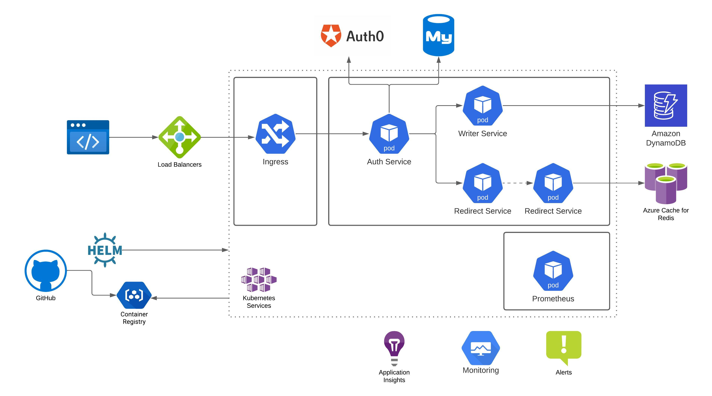
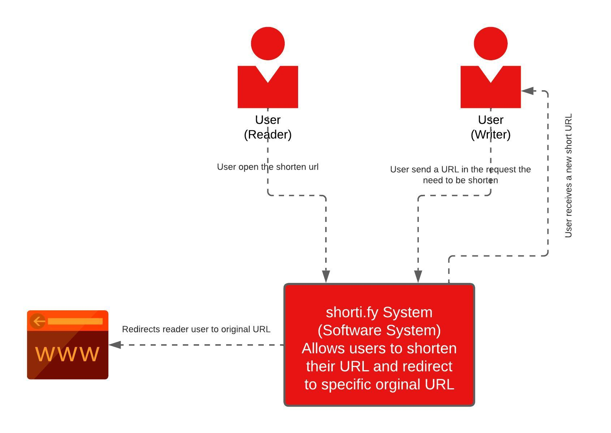
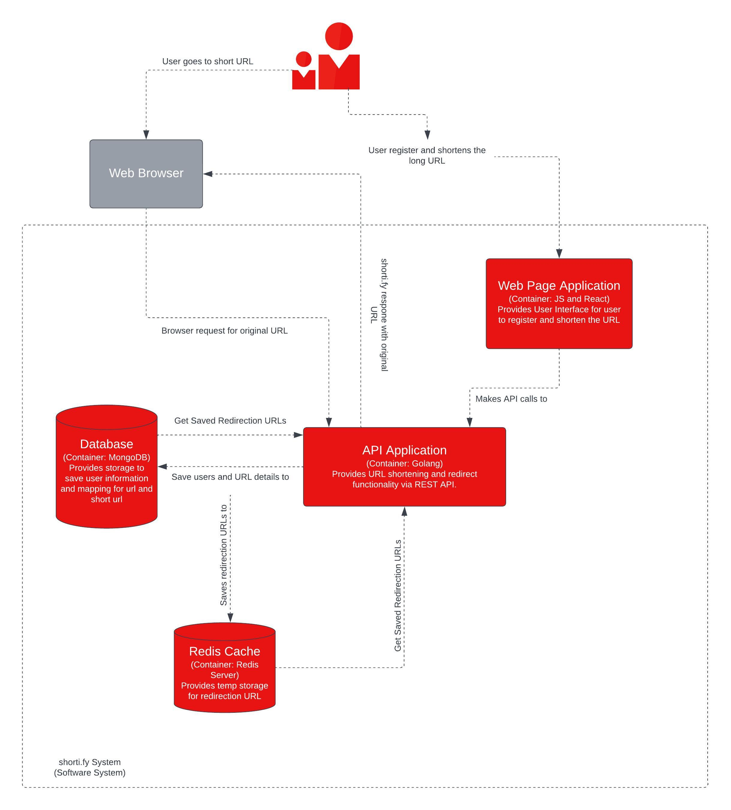
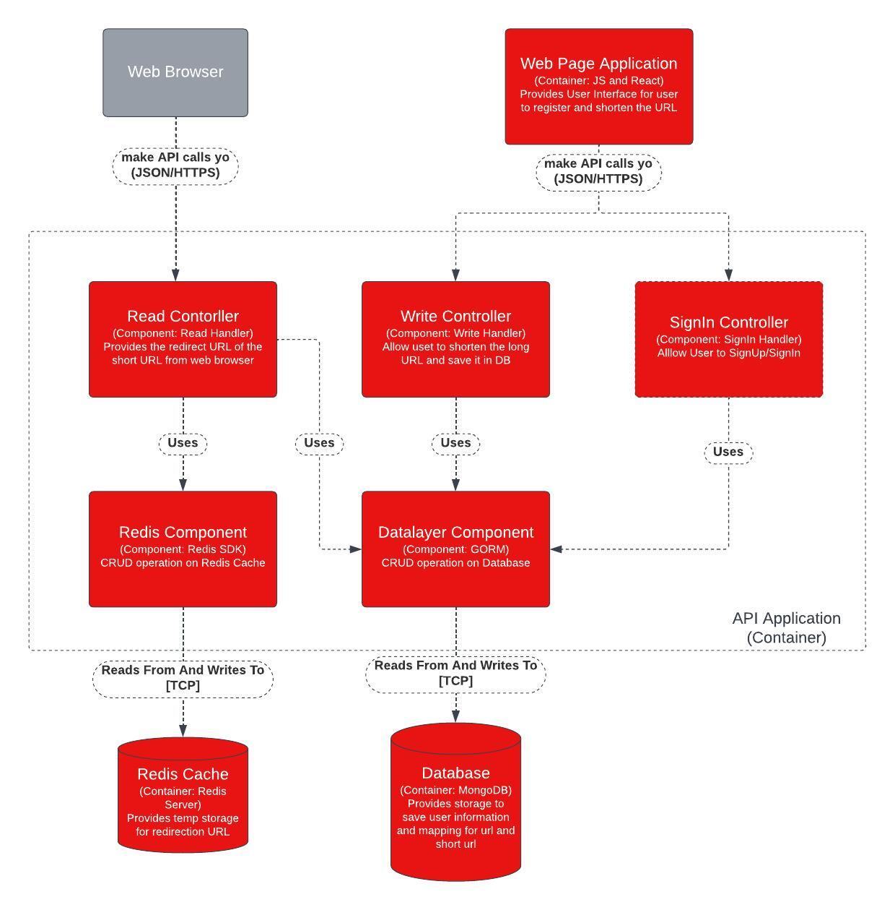
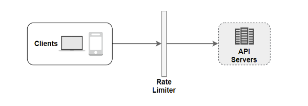

# shorti.fy

## Get Started
1. [Writer Service](https://github.com/mehulgohil/shorti.fy/blob/main/writer/README.md)
2. [Redirect Service](https://github.com/mehulgohil/shorti.fy/blob/main/redirect/README.md)

## What is URL Shortening System?
In layman's terms, URL Shortening is a service we can shorten the original link.
You provide a long URL and system outputs a short URL which can be used as an alternative to long url.

## Requirement 
### Functional Requirement
1. URL Shortening Service
2. Users enter a long url and the system returns a shortened URL
3. A user visiting the short url is redirected to the original long url
4. Multiple user entering same long url gets different short url.
5. Short URL is readable
6. Short URL is non-predictable
7. Short URL is collision-free (unique)
8. Support analytics like number of hit-counts

### Non Functional Requirement
1. Scalable
2. Highly Available
3. Low latency
4. Secure, example secure against spam etc

## Analysis
### Things to consider
1. Number of requests for reading the URL
2. Number of requests for writing (shortening) the URL
3. Storage requires for DB (Capacity)
4. Storage requires for caching (Redis)
5. Web server hosting (Ideal scenario would be to host on k8s which provides features of Auto Scaling, Auto Restart etc.) 
6. Shortening Algorithm Used
7. Security—Hackers can spam the system with random urls
8. Database type used for storage
9. Language use for backend

## Shortify Architecture

1. Two kinds of users
   1. Reader—User who will hit the short url and will be redirected to original long url
   2. Writer—User who comes to shorti.fy portal to shorten the URL
2. Web Servers—Backend servers that will transform/shorten the URL and also redirect user to original URl
3. Redis Cache - Caching layer that will be used in order ro cache the redirect url for more frequently used URls.
4. Database
5. Load Balancer - LB to distribute request among the web servers

## Selection of Language

### Golang Advantages
1. **Golang vs. Java**

   Java is compiled on a virtual machine, its code must be changed to bytecode before passing through the compiler. Even though this step makes it a platform-independent language, it significantly slows down the compilation process.
   Golang doesn’t rely on a virtual machine for code compilation and is directly compiled from the binary file. That’s why it is much faster than Java when it comes to application development. Golang’s automatic garbage collection also contributes to its speed and makes it much faster than Java

2. **Golang vs. C++**

   C++ modules often take a lot of time to parse and compile headers
   Golang only uses packages that are necessary to run the program. Golang has a feature that reminds the developer to remove unused packages from the final build. It throws a compilation error

3. **Golang vs. Node.js**

   Golang processing is faster and more lightweight than Node.js. Golang can also handle subroutines concurrently (i.e., it can execute threads in parallel). This is different from Node.js, which is single-threaded.
   
4. **Concurrency Golang**

   1. Traditional general purpose programming languages use threads provided and scheduled by the operating system (or a rather abstract concept of “workers” that are based on OS threads) to allow you to run multiple functions concurrently
   2. Those threads usually have a stack of a few megabytes in memory meaning that you can’t spawn too many of them, for example, 1000 threads where each consumes 1 MB of memory would require 1 GB of memory already.
   3. Context switches on OS threads aren’t cheap. Most registers and some caches will need to be swapped out.
   4. Go’s goroutines have a flexible stack that’s at least 2kb in memory, and it grows as needed. This means that you can literally spawn millions of them compared to only thousands of threads.
   5. Goroutines are multiplexed through an OS thread pool in the built-in runtime and can thus achieve 99.9% CPU utilization.
   6. Writing blocking Go code is totally fine since a goroutine will automatically be swapped out for another when it’s getting blocked without blocking the CPU. No async/await, no promises, no callbacks, no thread-pools, no tasks, just stupidly easy blocking code.
>Golang Advantages Refs
> 1. https://www.linkedin.com/pulse/how-company-reduced-its-number-server-from-30-2-using-reemi-shirsath/?trackingId=kW42HEEmScmba7MEC39bTA%3D%3D
> 2. https://www.linkedin.com/pulse/get-know-how-golang-contributing-bitly-reemi-shirsath/
> 3. https://www.bairesdev.com/blog/why-golang-is-so-fast-performance-analysis/
> 4. [Goroutines vs Thread](https://www.geeksforgeeks.org/golang-goroutine-vs-thread/)
> 

## Project Structure
For the Project Structure,
we will be implementing Dependency Injection architecture which would help us to decouple the controller,
service and data layer.
This type of architecture will help us in :-
1. Make our logic framework independent, you will be able to inject the same service layer in different web framework (controller layer) as well as CLI layer.
2. Independent database layer
3. Decoupling of different layers (controller, service, data)
4. Independent 3rd party library, no 3rd party library will be directly implemented (Redis SDK)
5. Highly Testable—This will help us to mock each layer interface and can easily write unit tests.

>Refs
> 
>1. [Service Pattern](https://github.com/irahardianto/service-pattern-go)
>

## Model

### 1. System Context Diagram

### 2. Container Diagram

### 3. Component Diagram

>Ref: [C4Model](https://c4model.com/)

## Database

As we're having a minimal structural requirement for DB (No database relationship required), we will be having 2 tables: one for user details and the other for storing the URL details.

Our database will be read intensively as we need to fetch the url and redirect the user accordingly. We will be using a key-value no sql database (Cassandra, DynamoDB)

## Authentication and Authorization

To secure our APIs, we will be using the OAuth2.0.
Currently, we have 2 flows that we can implement

### Implicit Flow
   Implicit flow is one of the types of OAuth2.0 flow.
   This flow is basically used for single page application. Here web page request directly the token and use that token to call the backend protected apis.

### Authorization Code Flow
   This is the most secure flow as it uses a backend channel to get the token.
   We will be having a separate backend Auth Server (middleware) which will be having the login, redirect, logout endpoints etc.

   The middleware will act as a proxy between the resource API and frontend.

   

   We will be implementing Backend for Frontend Patter (BFF).
   Where our middleware will act as a backend for frontend and will generate the token,
   and we use this token to access the shortify apis (writer).
   
   In our resource backend server we can validate the JWT token in the handler.
> Ref
> 
> [Token Handler Patter](https://levelup.gitconnected.com/secure-frontend-authorization-67ae11953723)
> [BFF](https://dev.to/damikun/web-app-security-understanding-the-meaning-of-the-bff-pattern-i85)

## Encoding Algo

For encoding, we will be using Base62 (Alphanumeric Values) with 7 characters.
This will generate upto (62^7) 3.5 Trillion unique short URLS.
Even if our system shortens 1000 new URLS per second, it will take approx 100 years to exhaust this list.

### Ways to generate short URL
#### 1. Random 7 character alphanumeric string
We randomly generate a unique string from alphanumeric characters of length 7

Problems: 
1. Probability that the hashed value can be collided (Very small chance but possible)

Probable Solution:
1. Each time a short url is generated, we check if that exists in DB or not, maybe with BLOOM Filter

#### 2. MD5 And Base62 Encode
MD5 algorithm as a hash function, then it will generate a hash value.
Base62 Encodes the hash, and we select the first 7 chars.

Problems:
1. This will output the same short url for the same long url, which is not acceptable for different users.
2. Probability that the hashed value can be collided (Because we're selecting the first 7 characters)

Probable Solutions:
1. We can append the root url with a counter value which increments each time a write request is called.
2. We append the root url with the user details this will ensure the uniqueness of short url. 
3. Given the fact that we will be selecting the first 7 characters,
we still need to check the database if hashKey exists to avoid the collision.

## Rate Limiting
Rate Limiting helps
to prevent the overloading of servers by limiting the number of requests that can be made in a given time frame.

### Where to Put the Rate Limiter?
#### 1. Server Side
On the Server Side, we can put rate limiter before the API as middleware handler. 
   This type of placement is not efficient if you have distrubuted architecture

#### 2. Rate Limiter Middleware MicroService
We can have a dedicated Rate Limiter Service, which throttles the request before it reaching the backend api servers.

#### 3. Nginx Controller Rate Limiter
If we're following K8s architectures, nginx gives a facility to rate limit out of the box.

>Ref: 
> 
> https://systemsdesign.cloud/SystemDesign/RateLimiter
> https://www.nginx.com/blog/microservices-march-protect-kubernetes-apis-with-rate-limiting/

### Coding Practices
#### 1. Iris Web Framework
In order to expose apis, we've used Iris Web Framework

> Ref: [Iris SDK](https://github.com/kataras/iris)
#### 2. Swagger
We have use swagger to document our apis.

>Ref: [Swag SDK](https://github.com/swaggo/swag)

#### 3. Logging
To log, we've used Zap

>Ref: [Zap](https://github.com/uber-go/zap)

#### 4. Mocking
To mock interfaces, we have use gomock

>Ref: [gomock](https://github.com/golang/mock)

#### 5. Redis
We've used redis to cache the redirect urls.

>Ref: [go-redis](https://github.com/redis/go-redis)
